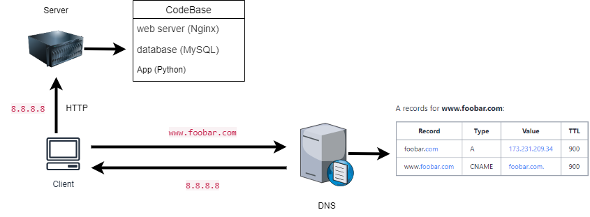
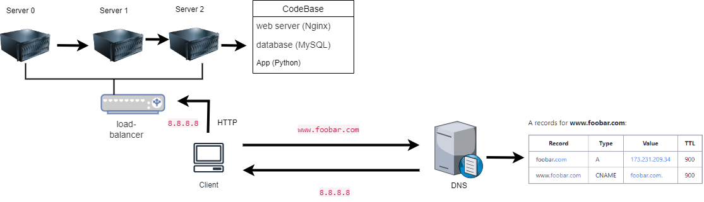
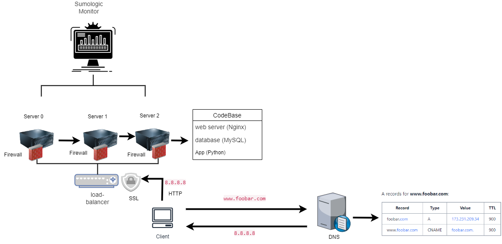

# 0x09-web_infrastructure_design

## Task 0: Simple web stack
- **File:** `0-simple_web_stack` 

## **Description** 
### Specifics about this infrastructure:
- A server is hardware or software that's runs an OS that provides a some kind of service or functionality to other devices or applications, usually located at a data center.
A ecorain name allons users to access websies without having to memorize the servers physical I address, In the case of this example. "w"is an
• The role of the web server is to handle the requests from the client/user and respond with HTML content.
• The role of the application server is to process and handle all the application logic being performed by the client/user. ted rol of the ata, is te por vide structure to the applications data by giving it a place to be stored where it can then be accessed and used as
• The client/user is communicating to the server using HTTP.

### Issues with this infrastructure design:
- With regards to SPOF, because there is only one server handling everything with regards to the system and nothing has been put in place to help avoid
SPOF, should the server fail, the entire system will go down.
• With regards to downtime, whenever maintenance needs to be done on the server, the server will be down because of the maintenance that needs to be done and therefore the site will be inaccessible to the user.
• With regards to scalability, this system is not scalable because it only has one

## Task 1: Distributed web infrastructure
- **File:** `1-distributed_web_infrastructure`

## **Description** 
### Additions made from the Simple Design:
• Two additional servers have been added to prevent reliance on one server, bringing the total to 3.
• A load balancer has also been added to manage the traffic coming into the site. The load balancer is configured with the least connections algorithm to direct the traffic when means it first checks all the servers to see which one has the least connections and then sends the request there.
• The load balancer also has an active-active setup. An active-active setup means that all the servers are working actively together, while the an active-passive set up has only one server active and the rest are on stand-by, ready to take over when needed.
• Now that we have more than one database, we have to implement the Primary-Replica cluster which means server 1 will be the Primary database (Primary node) with the responsibility of handling write operations (insert, update, delete), while servers 2 and 3 are the Replicas (Replica nodes) and they will be handling read operations and serve as backups

### Issues with this Distributed Infrastructure Design:
• The SPOF is now the load balancer as there is only one present in this design, should it fail then the site will go down.
• Security, there are no firewalls which means all kinds of traffic is allowed to access the site and no SSL is in place, which means client information is not encrypted.
• No monitoring has been put in place either, should there be any irregularities or issues with the system, there would be no way to tell what or where things went wrong.

## Task 2: Simple web stack
- **File:** `2-secured_and_monitored_web_infrastructure`

## **Description** 
### Additions made from the Distributed Design:
• Traffic is now served through HTTPS to encrypt data between the client and server
be granted access to the site.
• Monitoring has been added to collect the health and performance data of the system. The data is collected through the help of agents.
APls as well as logs from within the system. To monitor the sites QPS, a monitor capable of monitoring that would be needed for the job.

### Issues with this Secured and Monitored Infrastructure Design:
• The Load balancer is still a SPOF because it is still the only point of access to the site.
• SSL is currently being terminated at the load balancer which means client data is not being encrypted from the load balancer to the servers and that is a major security risk.
• All the servers running the same number of components is also not ideal because as the site grows different databases will take up different levels of consumption with regards to power and storage