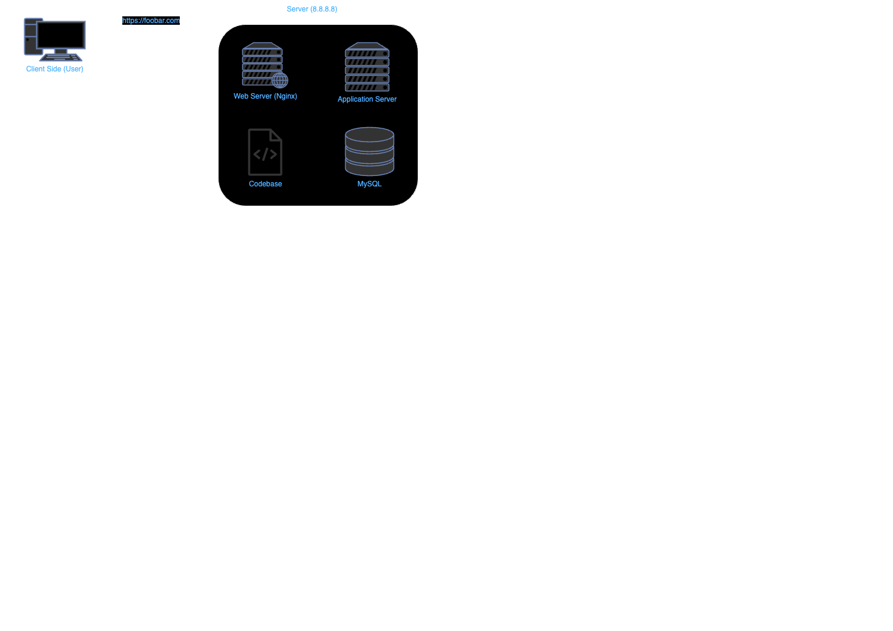
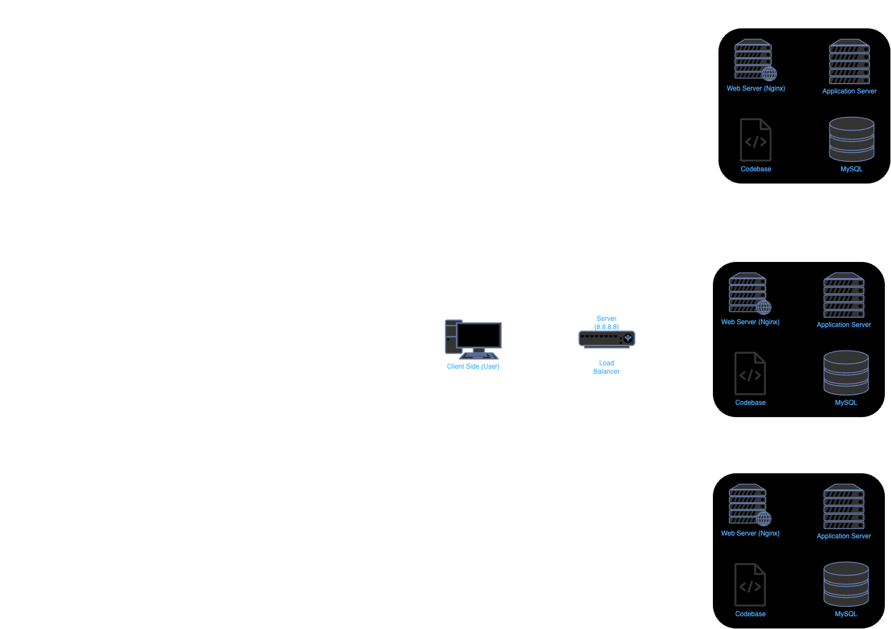
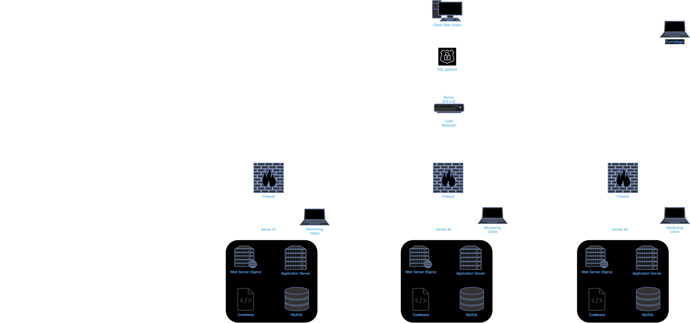

# 0x09-web_infrastructure_design

## Task 0: Simple web stack
- **File:** `0-simple_web_stack` 

## Task 1: Distributed web infrastructure
- **File:** `1-distributed_web_infrastructure`

## Task 2: Simple web stack
- **File:** `2-secured_and_monitored_web_infrastructure`

